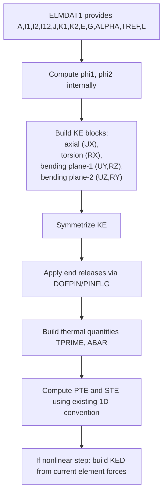
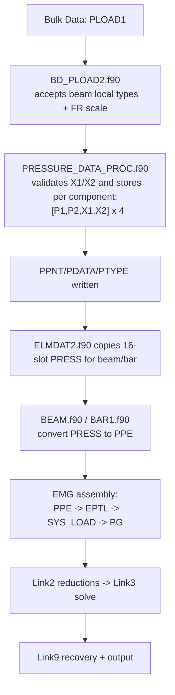
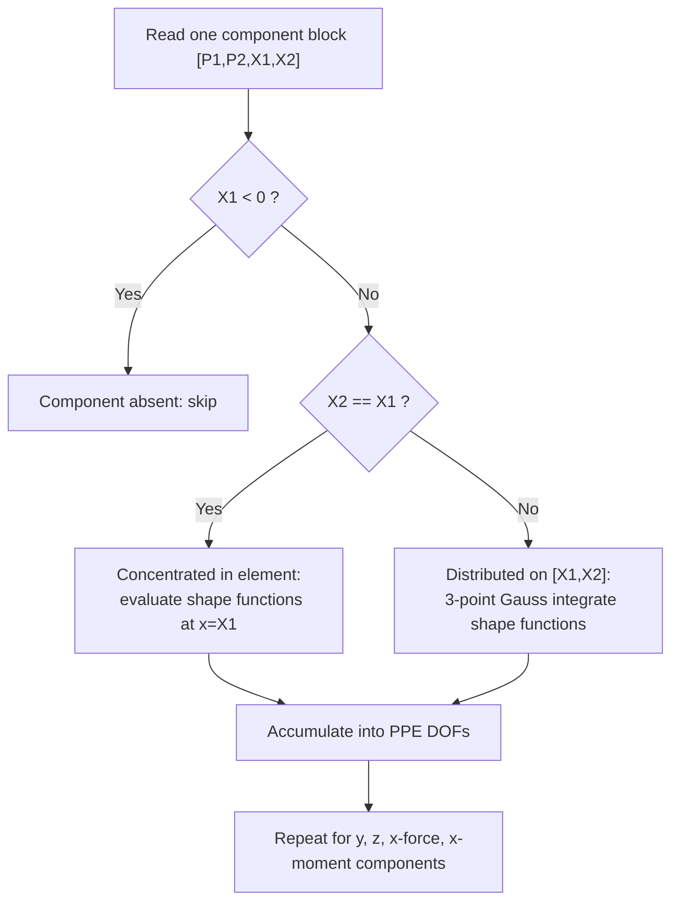
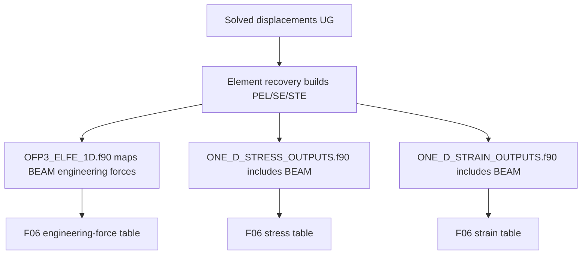

# CBEAM Modifications Overview (MYSTRAN 17)

This document summarizes the CBEAM work added in this branch and how it flows through MYSTRAN.

## Scope

Implemented and validated:

- 3D, 2-node, 12-DOF `CBEAM` stiffness path in `BEAM.f90`
- DSB/Timoshenko-style bending behavior in both bending planes via internal shear influence factors
- axial + torsion + two bending planes in one local 12x12 element matrix
- thermal load/recovery reuse through existing 1D thermal pipeline
- end release support via existing `DOFPIN -> PINFLG` mechanism
- `PLOAD1` equivalent nodal loads for:
  - local y (`FYE/FY/Y`)
  - local z (`FZE/FZ/Z`)
  - local x-force (`FXE`)
  - local x-moment (`MXE`)
  - local y-moment (`MYE`)
  - local z-moment (`MZE`)
  - full-span, partial-span, and concentrated-in-element (`X1=X2`)
- engineering-force + 1D stress/strain recovery path no longer hard-fails for BEAM

## Main Source Files Touched

- `Source/EMG/EMG3/BEAM.f90`
- `Source/EMG/EMG3/BAR1.f90` (same `PLOAD1` handling pattern for BAR)
- `Source/LK1/L1D/PRESSURE_DATA_PROC.f90`
- `Source/EMG/EMG1/ELMDAT2.f90`
- `Source/Modules/SCONTR.f90`
- `Source/Modules/MODEL_STUF.f90`
- `Source/LK1/L1A-BD/BD_PLOAD2.f90`
- `Source/LK9/L92/OFP3_ELFE_1D.f90`
- `Source/LK9/L92/ONE_D_STRESS_OUTPUTS.f90`
- `Source/LK9/L92/ONE_D_STRAIN_OUTPUTS.f90`

## CBEAM Element Formulation Flow (`BEAM.f90`)

## `PLOAD1` Pipeline Flow (Data To Solve)

## `PLOAD1` Equivalent Nodal Conversion Logic (`BEAM.f90`)

## Recovery/Output Flow (Static `SOL 101`)

## Internal `phi` Treatment

`phi` is not a new input field in v1. It is derived internally per element:

- `phi1 = 12*E*I1 / (K2*G*A*L^2)` for plane-1 block (`UY/RZ`)
- `phi2 = 12*E*I2 / (K1*G*A*L^2)` for plane-2 block (`UZ/RY`)

This keeps existing `PBEAM` inputs unchanged while enabling Timoshenko/DSB-like shear flexibility behavior.

## Current `PLOAD1` Behavior (Beam/Bar)

Supported now:

- full-span uniform load
- partial-span distributed load
- concentrated-in-element load (`X1=X2`)
- linear variation along loaded segment (`P1` to `P2`)

Current constraints:

- `SCALE=FR` only
- one `PLOAD1` entry per `(subcase, element, component)` in current implementation
- no global-direction `FX/FY/FZ/MX/MY/MZ` beam interpretation in this path

## Validation Decks

- [cbeam_validation_cantilever_point_load.md](E:/mystran17/mystran/dev_docs/cbeam_validation_cantilever_point_load.md)
- [cbeam_validation_axial_extension.md](E:/mystran17/mystran/dev_docs/cbeam_validation_axial_extension.md)
- [cbeam_validation_torsion.md](E:/mystran17/mystran/dev_docs/cbeam_validation_torsion.md)
- [cbeam_validation_portal_frame_2d.md](E:/mystran17/mystran/dev_docs/cbeam_validation_portal_frame_2d.md)
- [cbeam_validation_pload1.md](E:/mystran17/mystran/dev_docs/cbeam_validation_pload1.md)
- [cbeam_validation_pload1_axial_torsion.md](E:/mystran17/mystran/dev_docs/cbeam_validation_pload1_axial_torsion.md)
- [cbeam_validation_pload1_partial_concentrated.md](E:/mystran17/mystran/dev_docs/cbeam_validation_pload1_partial_concentrated.md)
- [cbeam_validation_pload1_mye_mze.md](E:/mystran17/mystran/dev_docs/cbeam_validation_pload1_mye_mze.md)

## Notes For GitHub Push

- This file is intended as the top-level summary for CBEAM changes.
- Mermaid diagrams render directly on GitHub in markdown view.
- If you want, we can next split this into `LINK1`, `EMG`, and `LINK9` sub-pages and link them as a mini index.
